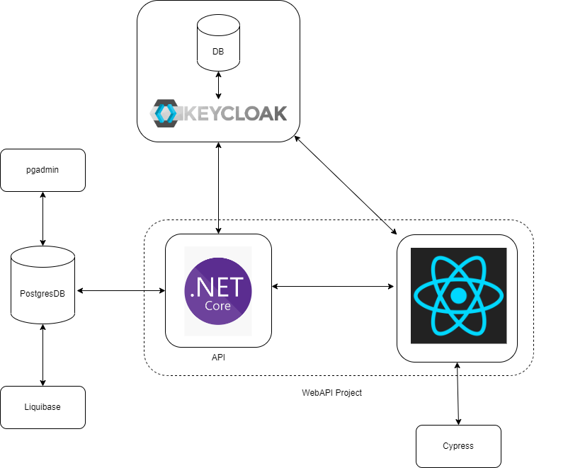

# "Pod Work POC" Project

## Overview
This project will create a basic Flutter web application that pulls data from an API / DB backend and displays it in a browser.

### Techology
* NodeJS
* Docker
* PostgreSQL
* Flutter

### Diagram

#### DB
The database can be spun up and associated Liquibase changelogs applied by using:

`cd ./database`
`docker-compose up`

The Liquibase container exits after applying the changelogs.

#### API
API runs on localhost:4002 using 

`cd ./api`
`npx serverless offline` 
This runs the server on port 4002, check using curl or Postman:
`curl localhost:4002`

### PGAdmin
The PGAdmin container allows inspection of the database by navigating to localhost:8090. The database can be connected to using the docker network gateway address, which can be found using `docker network inspect bridge`, and the username and password specified in the docker-compose setup.

#### .NET
Dotnet-calendar project runs on localhost:3000 (which will use the React project) using 

`cd ./dotnet-calendar`
`npm start`

#### React
The React calendar project has been moved to the dotnet-calendar project, and can be run on localhost:3005 using:

`cd ./dotnet-calentdar/ClientApp`
`npm start`

#### UI Testing
As the web UI is currently built using Flutter Web, the Cypress tool cannot be used for UI testing (https://stackoverflow.com/questions/58679661/testing-flutter-apps-with-cypress).

UI testing framework runs using:

`cd ./ui-test`
`npx cypress run` to run headless or
`npx cypress open` to open the Cypress console

The dotnet calendar draws data from the database set up under the ./database folder as a docker-compose project, as mentioned before.

#### Auth
Keycloak is used as an authentication/SSO solution as a stand-in for any OAuth / OIDC systems used.