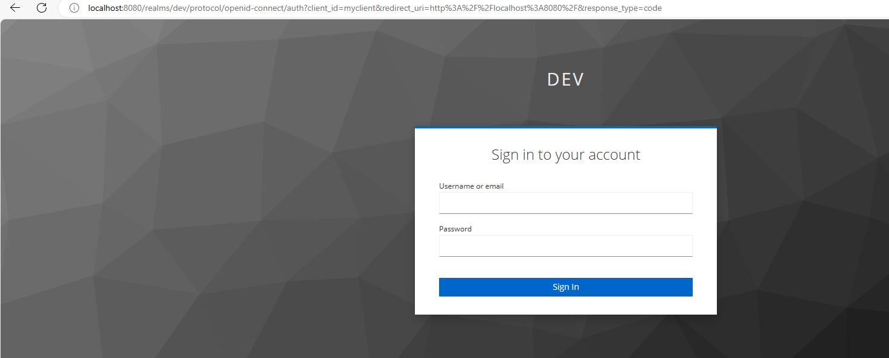

You should have a basic understanding of OIDC and Keycloak, but the basic outline to authenticate is as follows:

1. Start Keycloak running
2. Set up a realm and associated client with valid redirect URLS:

3. Check the available endpoints:

4. Use a browser to access the openid-connect/auth endpoint:

This is using the URL:

`localhost:8080/realms/dev/protocol/openid-connect/auth?client_id=myclient&redirect_uri=http%3A%2F%2Flocalhost%3A8080%2F&response_type=code`

This requires a use to be created inside the KC admin console:

Logging in as this user redirects to the `redirect_uri` with an authorisation code appended (in the `&code=` parameter):

`
http://localhost:8080/?session_state=fb64859b-9267-45a9-9b86-fc10e5b4c19c&code=6274f417-835a-43d2-9d82-76c7e345100a.fb64859b-9267-45a9-9b86-fc10e5b4c19c.a610c27a-fe87-4a52-8eef-fc6cb2b269c0
`

The authorisation code can then be used to make a request to /token endpoint.

The endpoints can be found by navigating to the `well-known` endpoint discussed earlier.

A token request can then be done:

`
curl --location 'http://localhost:8080/realms/dev/protocol/openid-connect/token' \
--header 'Content-Type: application/x-www-form-urlencoded' \
--data-urlencode 'grant_type=authorization_code' \
--data-urlencode 'client_id=myclient' \
--data-urlencode 'redirect_uri=http://localhost:8080/' \
--data-urlencode 'code=6edc2485-e66b-46da-9dd8-08c7d7d2b61c.fb64859b-9267-45a9-9b86-fc10e5b4c19c.a610c27a-fe87-4a52-8eef-fc6cb2b269c0'
`

which then returns our access and refresh tokens:

