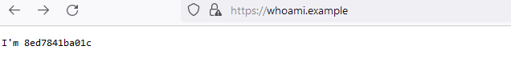
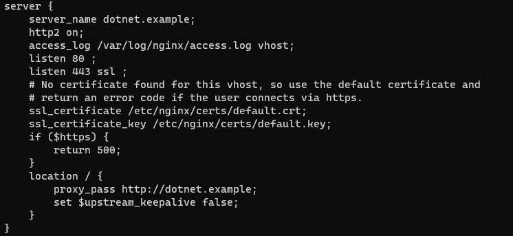
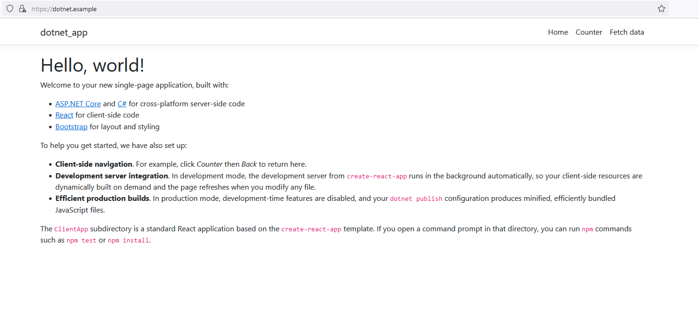

The docker-compose project consists of an NGINX proxy project https://github.com/nginx-proxy/nginx-proxy

this project requires three pre-requisites:

1) Docker
2) Docker-compose
3) modification of the Nginx container to allow https connections 
4) modification of the local hosts file to allow redirection to the container, e.g.:
```
# development
127.0.0.1 whoami.example
```
to ensure localhost redirection works correctly:


`
If HTTPS is enabled for a virtual host but its certificate is missing, nginx-proxy will configure nginx to use the default certificate (default.crt with default.key) and return a 500 error.
`

Certificates should be provided using the schema in the docs.

With regards to `3`, nginx configuration defaults to the following:



This default configuration will return a 500 error if a HTTPS connection is attempted, so we need to remove this check before loading nginx. This configuration is found in `/etc/nginx/conf.d/default.conf`. Remove the offending check and run `nginx -s reload` to reload the configuration.

Once this HTTPS check is commented out or removed, localhost redirect works correctly.



### NEXT STEPS
adding ssl for upstream servers
https://docs.nginx.com/nginx/admin-guide/security-controls/securing-http-traffic-upstream/